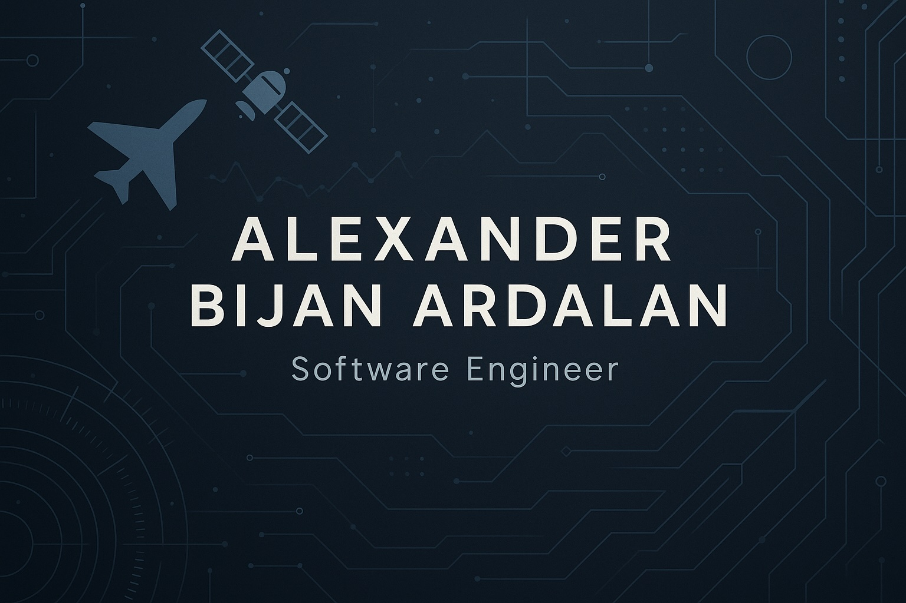

  
  
  

    <a href="https://www.bijancreates.com" target="_blank" style="text-decoration: none; color: inherit; margin-right: 15px;">
      
      My Portfolio
    </a>
    <a href="https://www.linkedin.com/in/alexander-bijan-ardalan/" target="_blank" style="text-decoration: none; color: inherit;">
      
      Connect on LinkedIn
    </a>
  

# 👋 Hi, I'm @EngineerAlexander (Bijan)

---

## 🚀 About Me

I obtained my degree in Mechanical Engineering at the University of California, San Diego in 2020. Upon graduating, I discovered a love for computer science, thereafter transitioning fully into the field within a couple of years.

I've had the privilege of developing software at:
- UCSD MAD (Medically Advanced Devices) Lab
- HP Inc.
- Northrop Grumman
- Boeing

---

## 🎯 Interests

-   App Development
-   Algorithms & Automation
-   Cryptocurrencies & Trading
-   Computer Vision
-   Artificial Intelligence
-   Real-time Applications

---

## 🌱 Specializations

-   **Top Languages:** Python, C++, Typescript
-   **Shells:** .csh, .zsh, .sh, .ksh
-   **OS:** MacOS, Windows, Linux

---

## 🛠️ Projects

I'm always working on exciting projects in various languages. Stay tuned for updates, or check out my repositories!

---

## 💞️ Collaboration

I'm looking to collaborate on anything interesting where I can learn new skills and contribute meaningfully.
